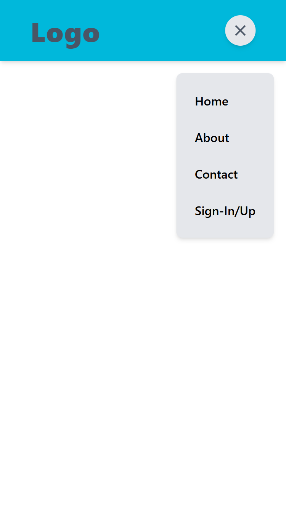

# React Responsive Navbar

A simple responsive navbar built with **React**, styled using **Tailwind CSS**, and powered by **React's `useState` hook** for interactive state management and conditional rendering.

## 🚀 Features

- Responsive design: visible hamburger menu on mobile, full nav on larger screens.
- Toggle functionality using React `useState`.
- Conditional rendering to show hamburger (`MenuOpenIcon`) or close (`CloseIcon`) icons.
- Clean and modern UI using Tailwind CSS.

## 🛠️ Tech Stack

- [React](https://reactjs.org/)
- [Tailwind CSS](https://tailwindcss.com/)
- [Material UI](https://mui.com/material-ui/material-icons/)(for adding icons)

## Screenshots

- Large Screen
  

- Small Screen
  

## Demo Link

[Live Demo](https://react-navbar-p08.netlify.app/)
